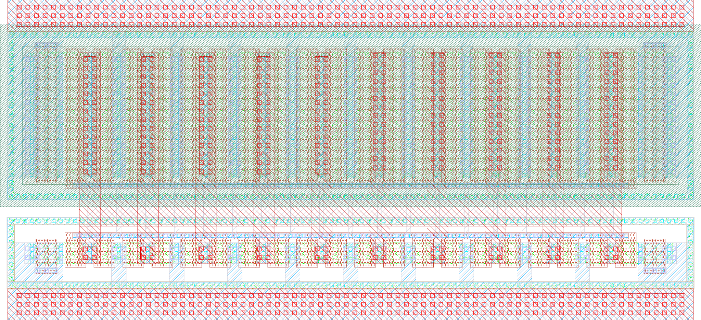

# ihp-sg13cmos5l Inverter

This is the analog example **sub-macro** of the HeiChips 2026 template: the unit `inverter` cell with its complete flow (schematic → simulation → layout → DRC/LVS/PEX → characterization). The hand-drawn top level that embeds it, including the HeiChips power ring, lives one directory up in [`heichips26_analog_project`](../../README.md).

<p align="center">
  <a href="final/render/inverter_white.png">
    
  </a>
  <br>
  <em>Render of the ihp-sg13cmos5l inverter layout.</em>
</p>


## Directory Structure

<details>
<summary>Show Directory Structure</summary>

```text
📁 inverter/
├─ 📁 final/
│  ├─ 📁 gds/
│  │  └─ inverter.gds
│  ├─ 📁 lef/
│  │  └─ inverter.lef
│  ├─ 📁 lib/
│  │  └─ inverter.lib
│  ├─ 📁 render/
│  │  ├─ inverter_black.png
│  │  └─ inverter_white.png
│  └─ 📁 vh/
│     └─ inverter.vh
├─ 📁 layout/
│  ├─ *.gds
│  ├─ *.klay.gds
│  └─ inverter.gds
├─ 📁 netlist/
│  ├─ 📁 layout/
│  │  ├─ *.cir
│  │  ├─ *.ext.spc
│  │  ├─ inverter_klayout.cir
│  │  └─ inverter_magic.ext.spc
│  ├─ 📁 pex/
│  │  ├─ *.spice
│  │  ├─ inverter_klayout_pex_*.spice
│  │  └─ inverter_magic_pex_*.spice
│  └─ 📁 schematic/
│     ├─ *.cdl
│     ├─ *.spice
│     ├─ inverter_klayout.cdl
│     └─ inverter_magic.spice
├─ 📁 schematic/
│  └─ 📁 xschem/
│     ├─ *.sch
│     ├─ *.sym
│     ├─ inverter.sch
│     ├─ inverter.sym
│     ├─ inverter_pex.sym
│     └─ xschemrc
├─ 📁 scripts/
│  ├─ 📁 sizing/
│  │  ├─ 📁 data/
│  │  ├─ 📁 figures/
│  │  ├─ lookup_commands.ipynb
│  │  └─ sizing_inverter.ipynb
│  ├─ check_pex_ports.py
│  ├─ lay2img.py
│  ├─ sak-drc.sh
│  ├─ sak-lvs.sh
│  ├─ sak-pex.sh
│  ├─ sak-pin-reorder.py
│  └─ .sak-scripts-version
├─ 📁 testbenches/
│  └─ 📁 xschem/
│     ├─ 📁 plot_simulations/
│     │  ├─ 📁 data/
│     │  ├─ 📁 figures/
│     │  ├─ ngspice2python.py
│     │  └─ plot_inverter.py
│     ├─ *_tb_*.sch
│     ├─ inverter_tb_ac_ol.sch
│     ├─ inverter_tb_tran.sch
│     ├─ inverter_tb_dc_vout.sch
│     └─ xschemrc
├─ 📁 verification/
│  ├─ 📁 cace/
│  │  ├─ 📁 results/
│  │  ├─ 📁 scripts/
│  │  ├─ 📁 templates/
│  │  └─ inverter.yaml
│  ├─ 📁 drc/
│  │  ├─ 📁 *.klayout.drc/
│  │  ├─ 📁 *.magic.drc/
│  │  ├─ 📁 inverter.klayout.drc/
│  │  └─ 📁 inverter.magic.drc/
│  └─ 📁 lvs/
│     ├─ 📁 *.klayout.lvs/
│     ├─ 📁 *.magic.lvs/
│     ├─ 📁 inverter.klayout.lvs/
│     └─ 📁 inverter.magic.lvs/
├─ Makefile
└─ README.md
```

</details>


## Vendored Verification Scripts (`sak-*`)

The DRC/LVS/PEX targets use the `sak-*` Swiss-Army-Knife scripts from [IIC-OSIC-TOOLS](https://github.com/iic-jku/IIC-OSIC-TOOLS). Because this template runs in the **nix-shell** (not the IIC-OSIC-TOOLS container, where they are pre-installed), the scripts are vendored in `scripts/`:

- `sak-drc.sh` — DRC with Magic or KLayout
- `sak-lvs.sh` — LVS with Magic + Netgen or KLayout
- `sak-pex.sh` — parasitic extraction with Magic
- `sak-pin-reorder.py` — reorders extracted `.subckt` pins to match an Xschem symbol

`scripts/.sak-scripts-version` records the IIC-OSIC-TOOLS commit they were taken from. The scripts require the `PDKPATH` (`$PDK_ROOT/$PDK`) and `STD_CELL_LIBRARY` environment variables, which the Makefile exports automatically.


## Makefile Targets

### Show Available Targets

The default Make target is `help`, so running `make` prints usage and all available targets with short descriptions.

```sh
make
make help
```

The `sim-xschem` target accepts an optional `TB=<testbenchname>` parameter (default: `<CELL>_tb_tran`), and `sim-view-xschem` an optional `SCRIPT=<scriptname>` parameter (default: `plot_<CELL>`).

All targets that operate on a specific cell accept an optional `CELL=<cellname>` parameter. The default is the top-level cell (`inverter`).

```sh
make <target> [CELL=<cellname>] [EXT_MODE=<1|2|3>] [THRESHOLD=<mOhm>] [MINRES=<mOhm>] [MINDELAY=<ps>] [DRC_LEVEL=<precheck|macro|regular>] [EV_PRECISION=<digits>]
```


### Layout File Extension Usage

The Makefile defines a `_GDS_EXT` variable that auto-selects the layout file extension: it prefers `.gds` when available, and falls back to `.klay.gds` otherwise.

- Targets that use `layout/<name>.$(_GDS_EXT)` and work with either `.gds` or `.klay.gds` (the `sak` scripts derive the GDS top cell name from the `<name>.klay.gds` naming convention):
  - `klayout-lvs`
  - `klayout-drc`
  - `klayout-pex`
  - `magic-lvs`
  - `magic-drc`
  - `magic-pex`

- Build targets always use `layout/<name>.gds`:
  - `lef`
  - `copy-gds`
  - `render-gds`


### Run Xschem Testbench Simulation

Runs a single Xschem testbench in batch mode (no display): saves the schematic, exports the netlist to `testbenches/xschem/simulations/`, and runs the simulator.

The target netlists the testbench with `xschem netlist` and then invokes `ngspice -b` directly instead of using `xschem simulate`. `xschem simulate` would spawn an interactive ngspice in a terminal detached from `make`: the target would return immediately, the result would never be checked, and the process would leak. Running the simulator directly makes `make` block until the run finishes and see its exit status.

Because the run is headless, the `plot` commands in a testbench's `.control` block are a no-op and no plot windows appear. Every testbench instead exports its results with `wrdata` to `testbenches/xschem/plot_simulations/data/`, from where they are plotted with `sim-view-xschem`.

The testbench is selected with the `TB` variable, given without the `.sch` extension (default: `<CELL>_tb_tran`):

```sh
make sim-xschem                     # run the default testbench (default: <CELL>_tb_tran)
make sim-xschem TB=<testbenchname>  # run another testbench
```

For example:

```sh
make sim-xschem TB=inverter_tb_ac_ol
make sim-xschem TB=inverter_tb_tran
make sim-xschem TB=inverter_tb_dc_vout
```

All available testbench schematics are located in `testbenches/xschem/`. Generated netlists are written to `testbenches/xschem/simulations/`.


### Plot Xschem Simulation Results

Plots simulation results using the Python script selected by `SCRIPT`, given without the `.py` extension (default: `plot_<CELL>`):

```sh
make sim-view-xschem                      # run the default plotting script (default: plot_<CELL>)
make sim-view-xschem SCRIPT=<scriptname>  # run another plotting script
```

The target runs `SHOW_PLOTS=1 python3 testbenches/xschem/plot_simulations/<SCRIPT>.py`. Every script writes its figures to `testbenches/xschem/plot_simulations/figures/`. The interactive plot windows only open when `SHOW_PLOTS` is set (the target sets it). Running a script directly without it is fully headless and just writes the figures.

Examples:

```sh
make sim-view-xschem SCRIPT=plot_inverter
```


### CACE Simulations

Runs [CACE](https://github.com/fossi-foundation/cace) characterization for the inverter macro using `verification/cace/inverter.yaml`.

> [!NOTE]
> Currently, CACE is not part of the nix shell.

The `sim-cace` target runs these parameter sets in sequence:
- `ac_mm_params`
- `ac_mc_params`
- `ac_params`

For each run, selected result plots are copied to `verification/cace/results/inverter/`, and temporary `_runs` folders are cleaned between runs. At the end, `_runs`, `_docs`, and `netlist` under `verification/cace/` are removed.

Run with:

```sh
make sim-cace
```

Result plots are saved to:
- `verification/cace/results/inverter/`
  - `Adc_ol_dB_mm.png`, `fcu_mm.png`
  - `Adc_ol_dB_mc.png`, `fcu_mc.png`
  - `Adc_ol_dB_vs_vdd.png`, `fcu_vs_vdd.png`


### Simulate All

Runs all simulation steps in sequence:
- `make sim-xschem TB=inverter_tb_ac_ol`
- `make sim-xschem TB=inverter_tb_tran`
- `make sim-xschem TB=inverter_tb_dc_vout`

`sim-cace` is intentionally not part of `sim-all` because CACE is currently not available in the nix shell.

Invoke with:

```sh
make sim-all
```

> [!NOTE]
> The `sim-view-xschem` target is intentionally **not** called by `sim-all`.
> It opens the generated Python figures, which blocks the shell until the window is closed.
> They are designed for interactive use and must be called manually after the simulation has completed.


### Build Top Cell

Builds the top-level cell deliverables in sequence: LEF export, LIB generation, Verilog stub generation, GDS copy, and layout image rendering:

```sh
make build-top
```


### Export LEF

Exports a LEF file (`final/lef/<TOP>.lef`) from the top-level layout GDS in `layout/` using Magic with the `-hide` option:

```sh
make lef
```


### Liberty Timing Library

Generates a Liberty timing library stub (`final/lib/<TOP>.lib`) with default threshold settings for the top-level cell:

```sh
make lib
```


### Verilog Stub

Generates a Verilog stub (`final/vh/<TOP>.vh`) for top-level integration by parsing pins from an extracted PEX netlist in `netlist/pex/`.

The `verilog` target:
- requires one of the following PEX files (run `make magic-pex` or `make klayout-pex` first):
  - `netlist/pex/<TOP>_magic_pex_1.spice`
  - `netlist/pex/<TOP>_magic_pex_2.spice`
  - `netlist/pex/<TOP>_magic_pex_3.spice`
  - `netlist/pex/<TOP>_klayout_pex_1.spice`
  - `netlist/pex/<TOP>_klayout_pex_2.spice`
  - `netlist/pex/<TOP>_klayout_pex_3.spice`
- auto-selects the first existing file from the list above
- reads the `.subckt <TOP>_pex` pin list (including continuation lines)
- emits recognized supply pins (`VDD`, `VSS`, `VPWR`, `VDPWR`, `VAPWR`, `VGND`, `VNB`, `VPB`) as `inout` under `` `ifdef USE_POWER_PINS ``
- classifies signal pins by prefix: `di_*` as `input`, `do_*` as `output`, others as `inout`
- collapses indexed pins (`name[i]`) into vector ports (e.g. `inout [7:0] ui_in`)

```sh
make verilog
```


### Copy GDS

Copies the top-level GDS from `layout/` to `final/gds/`:

```sh
make copy-gds
```


### Render Layout Image

Renders the top-level layout GDS with `scripts/lay2img.py` and saves the two images `inverter_black.png` and `inverter_white.png` in `final/render/`:

```sh
make render-gds
```


### Design Rule Check (DRC)

Runs DRC on the layout in `layout/`. Both flows use the vendored `scripts/sak-drc.sh`.

- `klayout-drc` and `magic-drc` use `layout/<CELL>.$(_GDS_EXT)` (`.gds` if present, otherwise `.klay.gds`)

Reports are written into per-cell run folders: `verification/drc/<CELL>.magic.drc/` (Magic) and `verification/drc/<CELL>.klayout.drc/` (KLayout, `.lyrdb`). The run folders are wiped at the start of each run, so they always reflect the latest run only.

The `DRC_LEVEL` parameter selects the KLayout DRC level (`sak-drc.sh -l`). It is ignored by `magic-drc`, since Magic has no selectable rule decks and always runs the full rule set compiled into the PDK's Magic tech file:

- `precheck` = core FEOL + BEOL manufacturing rules only (fast iteration)
- `macro` = block-in-isolation sign-off: `precheck` plus off-grid, zero-area, and pin/label checks (default)
- `regular` = full-chip sign-off: all checks, including density and antenna

| Check | `precheck` | `macro` _(default)_ | `regular` |
| --- | :---: | :---: | :---: |
| FEOL + BEOL core rules | ✓ | ✓ | ✓ |
| Off-grid / angle | – | ✓ | ✓ |
| Zero-area / geometry | – | ✓ | ✓ |
| Pin / label | – | ✓ | ✓ |
| Recommended / extra rules | – | – | ✓ |
| Density (chip-level fill) | – | – | ✓ |
| Antenna | – | – | ✓ |

**KLayout DRC** runs a KLayout DRC at the selected `DRC_LEVEL`:

```sh
make klayout-drc
make klayout-drc CELL=inverter
make klayout-drc CELL=inverter DRC_LEVEL=regular
```

**Magic DRC** runs a Magic DRC with all subcells flattened (`sak-drc.sh -f "*"`):

```sh
make magic-drc
make magic-drc CELL=inverter
```


### Export Schematic Netlist for LVS

Exports the schematic netlist for LVS from Xschem and places it in `netlist/schematic/`.

The `EV_PRECISION` parameter sets the number of significant digits used by Xschem's `ev` function when calculating device properties (default: 5). Increase this to avoid LVS mismatches caused by floating-point rounding differences between Xschem and KLayout (see [xschem#465](https://github.com/StefanSchippers/xschem/issues/465)).

The `ntap` and `ptap` substrate contacts are ignored during LVS in both flows. `sak-lvs.sh` runs KLayout LVS with the `--disable_tap_extraction` option so it does not extract `ntap` and `ptap` devices from the layout (matching Magic + Netgen LVS).

KLayout uses CDL netlists, while Magic uses SPICE netlists. Accordingly, `klayout-lvs-netlist` uses the Xschem commands `set spiceprefix 1`, `set lvs_netlist 1`, `set top_is_subckt 1`, and `set lvs_ignore 1`, while `magic-lvs-netlist` uses `set spiceprefix 1`, `set lvs_netlist 0`, `set top_is_subckt 1`, and `set lvs_ignore 1`. Hence, switching between CDL and SPICE netlists can be done with `lvs_netlist`.

To extract a CDL schematic netlist for KLayout LVS, use:
```sh
make klayout-lvs-netlist
make klayout-lvs-netlist CELL=inverter
make klayout-lvs-netlist EV_PRECISION=5
```

To extract a SPICE schematic netlist for Magic + Netgen LVS, use:
```sh
make magic-lvs-netlist
make magic-lvs-netlist CELL=inverter
make magic-lvs-netlist EV_PRECISION=5
```


### Layout Versus Schematic (LVS)

Exports the schematic netlist from Xschem, then runs LVS. Compares the layout in `layout/` against the schematic netlist in `netlist/schematic/`.

- `klayout-lvs` and `magic-lvs` use `layout/<CELL>.$(_GDS_EXT)` (`.gds` if present, otherwise `.klay.gds`)

Both flows use the vendored `scripts/sak-lvs.sh` and write their reports into per-cell run folders: `verification/lvs/<CELL>.magic.lvs/` (Magic + Netgen) and `verification/lvs/<CELL>.klayout.lvs/` (KLayout, `.lvsdb`). The run folders are wiped at the start of each run, so they always reflect the latest run only. The extracted layout netlist is moved to `netlist/layout/`.

**KLayout LVS** uses `sak-lvs.sh` (KLayout mode `-k`), which wraps `run_lvs.py` from the IHP Open-PDK:

```sh
make klayout-lvs
make klayout-lvs CELL=inverter
```

**Magic + Netgen LVS** uses `sak-lvs.sh` (Magic + Netgen mode, the default), which extracts the layout netlist with Magic and compares it against the schematic netlist with Netgen:

```sh
make magic-lvs
make magic-lvs CELL=inverter
```


### Parasitic Extraction (PEX)

Runs parasitic extraction on the layout in `layout/`. The extracted SPICE netlist is written to `netlist/pex/`.

- `klayout-pex` and `magic-pex` use `layout/<CELL>.$(_GDS_EXT)` (`.gds` if present, otherwise `.klay.gds`)

The extracted SPICE filenames include the selected extraction mode:
- `klayout-pex` writes `netlist/pex/<CELL>_klayout_pex_<EXT_MODE>.spice`
- `magic-pex` writes `netlist/pex/<CELL>_magic_pex_<EXT_MODE>.spice`

The `EXT_MODE` parameter selects the extraction mode:
- `1` = C-decoupled
- `2` = C-coupled
- `3` = full-RC (default)

> [!NOTE]
> For `klayout-pex`, `EXT_MODE=1` (C-decoupled) is not yet supported by kpex and automatically falls back to `EXT_MODE=2` (CC) with a warning.

The `.subckt` name in the extracted SPICE file is `<CELL>_pex`: `magic-pex` sets it directly via the `sak-pex.sh` option `-n <CELL>_pex`, while for `klayout-pex` it is automatically renamed from `<CELL>` (kpex).

If a matching Xschem symbol (`schematic/xschem/<CELL>_pex.sym`) exists, the `.subckt` pin order in the extracted SPICE file is automatically reordered with the vendored `scripts/sak-pin-reorder.py` to match the symbol's pin positions. This ensures the PEX netlist can be used directly with the corresponding Xschem symbol for simulation regardless of the selected `EXT_MODE`.

Both targets finish by running [`scripts/check_pex_ports.py`](scripts/check_pex_ports.py) on the netlist they just wrote. It verifies that every pin of the `.subckt` really reaches the circuit, and fails the target otherwise. Two cases are caught:

- A port that is declared in the `.subckt` line but referenced by no element at all. Whatever is wired to that pin from outside is then left floating.
- A port whose net was split into `<port>.t<n>` and `<port>.n<n>` fragments by `extresist` (`EXT_MODE=3`), where none of the fragments is connected back to the port. The pin is then dangling even though the fragments themselves are wired up.

Both produce a netlist that ngspice reads without a single warning while the cell behaves completely differently in simulation, so the check is worth the two seconds it costs. It can also be run by hand on any SPICE netlist:

```sh
python3 scripts/check_pex_ports.py netlist/pex/inverter_magic_pex_2.spice
python3 scripts/check_pex_ports.py -v netlist/pex/*.spice     # -v also prints the size of each subcircuit
```

**KLayout PEX** uses `kpex` with the Magic extraction engine currently (2.5D engine is work in progress):

> [!WARNING]
> `kpex` does not support the `ihp-sg13cmos5l` PDK yet, so the `klayout-pex` target currently fails (kpex is also not part of the nix shell). Use `magic-pex` for parasitic extraction until kpex gains CMOS5L support. In the `klayout-verify` target, the `klayout-pex` target is currently commented out.

```sh
make klayout-pex
make klayout-pex CELL=inverter
make klayout-pex CELL=inverter EXT_MODE=3
```

**Magic PEX** uses the vendored `scripts/sak-pex.sh`, which extracts the parasitics with Magic (C-decoupled, C-coupled, or full-RC):

```sh
make magic-pex
make magic-pex CELL=inverter
make magic-pex CELL=inverter EXT_MODE=3
```

For full-RC extraction (`EXT_MODE=3`), `magic-pex` additionally exposes the three `extresist` tuning parameters of `sak-pex.sh`. They are ignored in `EXT_MODE=1`/`2`.

A full-RC extraction models every wire as a resistor network, and most of those wires are so short that their resistance does not matter. The three parameters are the filters Magic applies to keep only the part of the network that is worth having. They run in this order:

1. **`THRESHOLD`** (`-t`, in mOhm, default `10000` = 10 Ohm) decides **which nets are extracted at all**. Before doing any real work, Magic makes a quick end-to-end resistance guess for every net. The guess is deliberately pessimistic, it is an absolute worst case. Nets that stay below `THRESHOLD` even in that worst case cannot matter, so they are treated as ideal wires and skipped. This is the cheap first pass that removes the many short, low-resistance nets.
2. **`MINDELAY`** (`-y`, in ps, default `1`) decides **which of the extracted nets are kept**. Because the guess above overestimates, Magic re-checks each net once it has been properly extracted and discards its resistor network again if the RC delay it adds stays below `MINDELAY`. Setting `MINDELAY=0` switches the delay criterion off and applies `THRESHOLD` a second time instead, now against the accurately extracted resistance rather than the initial guess.
3. **`MINRES`** (`-r`, in mOhm, default `1000` = 1 Ohm) decides **how detailed the kept networks are**. Inside a net, neighbouring resistors below `MINRES` are merged as far as possible, which shrinks the network without changing its overall resistance much.

In short: `THRESHOLD` and `MINDELAY` control *how many* nets carry parasitic resistance, `MINRES` controls *how finely* each of them is modelled. Raising all three gives a smaller netlist that simulates faster with less detail, lowering them gives a more accurate but considerably larger one.

```sh
make magic-pex CELL=inverter EXT_MODE=3 THRESHOLD=5000 MINRES=500 MINDELAY=2
```


### Verify with KLayout

**Verify a single cell** by running DRC and LVS in sequence:

```sh
make klayout-verify
make klayout-verify CELL=inverter
```

**Verify all cells**

```sh
make klayout-verify-all
```


### Verify with Magic

**Verify a single cell** by running DRC, LVS, and PEX in sequence:

```sh
make magic-verify
make magic-verify CELL=inverter
```

**Verify all cells**

```sh
make magic-verify-all
```


### Verify, Build and Simulate All

Runs the full flow in sequence: KLayout verification, Magic verification, top-level build deliverables, and simulations (`klayout-verify-all`, `magic-verify-all`, `build-top`, `sim-all`):

```sh
make all
```

Verification runs first because DRC/LVS/PEX produce the fresh, pin-reordered PEX netlists from the current layout. The build follows, since the Verilog stub reads its pins from a PEX netlist. The simulations run **last**, so the `inverter` testbench includes the PEX netlist produced by this run, not by a previous one.


### Clean

`make clean` deletes all generated files and folders. The sources (schematics, symbols, testbenches, the layout, the scripts, and the CACE configuration) stay untouched. Deleted are:

- `final/` (GDS, LEF, LIB, Verilog stub, and layout render deliverables)
- `netlist/` (schematic, layout, and PEX netlists)
- `verification/drc/` and `verification/lvs/` (DRC and LVS reports)
- `testbenches/xschem/simulations/` and the `plot_simulations/` outputs (`data/`, `figures/`, `__pycache__/`)
- the CACE outputs under `verification/cace/` (`_runs/`, `_docs/`, `netlist/`, `results/`)

Every Makefile target recreates its output folders, so a clean rebuild is simply:

```sh
make clean
make all
```

> [!NOTE]
> The Xschem testbenches `.include` the PEX netlist `netlist/pex/inverter_magic_pex_3.spice`. Directly after `make clean`, run `make magic-pex` (or the full `make all`) once before `make sim-xschem` / `make sim-all`, otherwise the include fails.


## Start a New Macro from This Template

The inverter is a good starting point for a new analog sub-macro of `heichips26_analog_project`:

1. Copy the `inverter` folder inside `macros/`.
2. Execute `make clean` in the new folder.
3. Rename `TOP` in the `Makefile`. All targets derive their file paths from `TOP` (and `CELL`, which defaults to `TOP`), so the design files must carry the same name.
4. Rename the Xschem schematic, symbol, and testbench files.
5. Rename the KLayout layout file **and the top cell inside the GDS** (open it in KLayout, rename the cell, save). The verification targets require matching file and top-cell names.
6. Register the new macro in the parent [`heichips26_analog_project` Makefile](../../Makefile): add a `build-<name>` target and call it from `build-macros`, and add a `clean-<name>` target called from `clean-macros`. To use the new symbols from the top level, also append the macro's schematic folder to the top-level `xschemrc` files.

For a new macro named `amp`, this looks as follows (starting from `macros/`):

```sh
cp -r inverter amp
cd amp
make clean
# set TOP = amp in the Makefile, then:
for f in schematic/xschem/inverter* testbenches/xschem/inverter*; do
    mv "$f" "$(echo "$f" | sed 's/inverter/amp/')"
done
mv layout/inverter.gds layout/amp.gds
```

Finally, update the remaining `inverter` references inside the renamed files with search-and-replace in a text editor, for example the `inverter.sym` instances and the `.include` of the PEX netlist in the testbenches (Xschem files are plain text).
