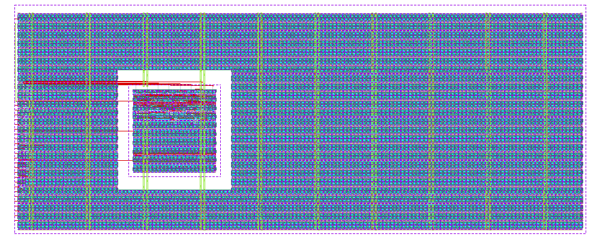

# HeiChips26 Digital Project (ihp-sg13cmos5l)

<p align="center">
  <a href="final/render/heichips26_digital_project.png">
    
  </a>
  <br>
  <em>Render of the ihp-sg13cmos5l heichips26_digital_project layout.</em>
</p>

This is the digital-on-top example project for the HeiChips 2026 Hackathon. The top-level `heichips26_digital_project` implements the standard chip interface (`ui_in`, `uo_out`, `uio_*`, `ena`, `clk`, `rst_n`) and embeds one hardened sub-macro, the 8-bit up [`counter`](macros/counter/README.md).


## Directory Structure

<details>
<summary>Show Directory Structure</summary>

```text
📁 heichips26_digital_project/
├─ 📁 final/
│  ├─ 📁 gds/
│  │  └─ heichips26_digital_project.gds
│  ├─ 📁 lef/
│  │  └─ heichips26_digital_project.lef
│  ├─ 📁 lib/
│  │  ├─ 📁 nom_fast_1p32V_m40C/
│  │  ├─ 📁 nom_slow_1p08V_125C/
│  │  └─ 📁 nom_typ_1p20V_25C/
│  ├─ 📁 nl/
│  │  └─ heichips26_digital_project.nl.v
│  ├─ 📁 pnl/
│  │  └─ heichips26_digital_project.pnl.v
│  ├─ 📁 render/
│  │  └─ heichips26_digital_project.png
│  ├─ 📁 spef/
│  │  └─ 📁 nom/
│  └─ 📁 vh/
│     └─ heichips26_digital_project.vh
├─ 📁 flow/
│  ├─ 📁 final/               # .gitignore'd — important files are copied to heichips26_digital_project/final/ (listed here to document LibreLane output folders)
│  │  ├─ 📁 def/              # Design Exchange Format — cell placement & routing (text-based)
│  │  ├─ 📁 gds/              # GDSII layout — final tape-out file
│  │  ├─ 📁 json_h/           # Yosys JSON headers — machine-readable netlist for internal scripts
│  │  ├─ 📁 klayout_gds/      # KLayout GDS — with extra visual-debug metadata
│  │  ├─ 📁 lef/              # Library Exchange Format — abstract pin & blockage view for P&R
│  │  ├─ 📁 lib/              # Liberty timing files — timing, power & area models
│  │  ├─ 📁 mag/              # Magic layout files — used for DRC & GDS generation
│  │  ├─ 📁 mag_gds/          # GDS generated/processed by Magic
│  │  ├─ 📁 nl/               # Netlist — gate-level Verilog after synthesis
│  │  ├─ 📁 odb/              # OpenDB — internal OpenROAD binary database (LEF+DEF combined)
│  │  ├─ 📁 pnl/              # Powered Netlist — gate-level Verilog with explicit power pins (for LVS)
│  │  ├─ 📁 render/           # Layout render images
│  │  ├─ 📁 sdc/              # Synopsys Design Constraints — clock periods & timing requirements
│  │  ├─ 📁 sdf/              # Standard Delay Format — timing delays for gate-level simulation
│  │  ├─ 📁 spef/             # Standard Parasitic Exchange Format — RC parasitics from layout
│  │  ├─ 📁 spice/            # SPICE netlist — for LVS & transistor-level simulation
│  │  ├─ 📁 vh/               # Verilog headers — for hierarchy management & simulation inclusion
│  │  ├─ metrics.csv          # Design metrics (area, power, timing slack, DRC/LVS) — spreadsheet
│  │  └─ metrics.json         # Design metrics (area, power, timing slack, DRC/LVS) — JSON summary
│  └─ 📁 librelane/
│     ├─ config.yaml
│     ├─ heichips26_template_large.def
│     ├─ heichips26_template_small.def
│     ├─ heichips26_template_small_analog.def
│     ├─ heichips26_template_tiny.def
│     ├─ heichips26_template_tiny_analog.def
│     ├─ impl.sdc
│     └─ signoff.sdc
├─ 📁 fpga/
│  ├─ 📁 arch/
│  │  ├─ ecp5.mk
│  │  ├─ gowin.mk
│  │  ├─ ice40.mk
│  │  └─ xilinx7.mk
│  ├─ 📁 boards/
│  │  ├─ basys3.mk
│  │  ├─ boolean.mk
│  │  ├─ icebreaker.mk
│  │  ├─ nano9k.mk
│  │  ├─ pico-ice.mk
│  │  └─ ulx3s.mk
│  ├─ 📁 design/
│  │  ├─ 📁 basys3/
│  │  ├─ 📁 boolean/
│  │  ├─ 📁 icebreaker/
│  │  ├─ 📁 nano9k/
│  │  ├─ 📁 pico-ice/
│  │  └─ 📁 ulx3s/
│  ├─ dut.mk
│  ├─ fpga.mk
│  ├─ Makefile
│  └─ README.md
├─ 📁 macros/
│  └─ 📁 counter/
├─ 📁 netlist/
│  ├─ 📁 nl/
│  │  └─ heichips26_digital_project.nl.v
│  ├─ 📁 pnl/
│  │  └─ heichips26_digital_project.pnl.v
│  └─ 📁 spice/
│     └─ heichips26_digital_project.spice
├─ 📁 rtl/
│  └─ heichips26_digital_project.sv
├─ 📁 testbenches/
│  ├─ 📁 cocotb/
│  │  ├─ heichips26_digital_project_tb.gtkw
│  │  └─ heichips26_digital_project_tb.py
│  └─ 📁 verilog/
│     ├─ heichips26_digital_project_tb.gtkw
│     └─ heichips26_digital_project_tb.sv
├─ 📁 verification/
│  ├─ antenna_summary.rpt
│  ├─ antenna_violations.rpt
│  ├─ stapostpnr_summary.rpt
│  ├─ stapostpnr_nom_fast_1p32V_m40C_power.rpt
│  ├─ stapostpnr_nom_slow_1p08V_125C_power.rpt
│  ├─ stapostpnr_nom_typ_1p20V_25C_power.rpt
│  ├─ irdrop.rpt
│  ├─ drc.magic.rpt
│  ├─ drc.klayout.json
│  ├─ lvs.netgen.rpt
│  ├─ manufacturability.rpt
│  ├─ stat.rpt
│  ├─ yosys_post_dff.rpt
│  ├─ yosys_pre_techmap.rpt
│  └─ yosys_synth_check.rpt
├─ Makefile
└─ README.md
```

</details>


## Sub-Macros

The `counter` is hardened as an own macro in [`macros/counter/`](macros/counter/) and integrated as a black box via the `MACROS` section in [`flow/librelane/config.yaml`](flow/librelane/config.yaml) (GDS, LEF, VH, LIB, SPEF views from `macros/counter/final/`).

**Build order matters**: if you modify the counter, run its own flow first (`make build-counter` from here, or equivalently `make -C macros/counter all`) so its `final/` views are up to date, then build this top level. The top-level `make all` does this automatically by running `build-macros` before `build-top`.

You can also remove all sub-macros and implement your design as sea-of-gates only: delete `macros/`, remove the `MACROS` section from `flow/librelane/config.yaml`, and put your RTL into `rtl/`.


## Makefile Targets

### Show Available Targets

The default Make target is `help`, so running `make` prints usage and all available targets with short descriptions.

```sh
make
make help
```


### Linting

To lint the Verilog/SystemVerilog source files with [Verilator](https://www.veripool.org/verilator/), run:

```sh
make lint-verilog                # lint the full heichips26_digital_project design (top + counter RTL)
make lint-verilog CELL=heichips26_digital_project   # equivalent: CELL defaults to heichips26_digital_project
make lint-verilog-all            # lint the counter sub-macro, then heichips26_digital_project
```

When `CELL=heichips26_digital_project` (the default), all synthesis sources (top level and the counter RTL) are passed to Verilator.
For another cell, the RTL source is auto-selected as `rtl/<CELL>.sv` when present, otherwise `rtl/<CELL>.v`.

The `lint-verilog-all` target runs these lint checks in sequence:

1. `make -C macros/counter lint-verilog-all`
2. `make lint-verilog` (default: `heichips26_digital_project`)

This is also the lint step used by `make all`.


### Verification and Simulation

We use [cocotb](https://www.cocotb.org/), a Python-based testbench environment, and [Icarus Verilog](https://github.com/steveicarus/iverilog) for the verification of the macro.

The simulation targets are unified and accept an optional `CELL` variable (default: `heichips26_digital_project`).
The waveform viewer can be changed with `WAVEFORM_VIEWER=<gtkwave|surfer>` (default: `gtkwave`).

> [!NOTE]
> [Surfer](https://surfer-project.org/) is currently **not** available in the nix shell — use the default GTKWave there. Surfer is provided by the IIC-OSIC-TOOLS container.

> [!NOTE]
> In the current repository state, the provided Verilog and cocotb testbench/viewer files are for `heichips26_digital_project`.
> Running simulation/view targets with another `CELL` requires corresponding testbench files (for example, `testbenches/verilog/<CELL>_tb.*` and `testbenches/cocotb/<CELL>_tb.py`).

#### RTL Verilog Simulation

Compiles the RTL (top level + counter) with Icarus Verilog and runs the simulation.
When `CELL=heichips26_digital_project` (the default), the full `MODULES_SIM` source list and the `.sv` testbench are selected automatically.
For other cells, the RTL source is auto-selected as `rtl/<CELL>.sv` when present, otherwise `rtl/<CELL>.v`, and the testbench likewise as `testbenches/verilog/<CELL>_tb.sv` when present, otherwise `testbenches/verilog/<CELL>_tb.v`.
The waveform is written to `testbenches/verilog/` (e.g. `testbenches/verilog/heichips26_digital_project_tb.fst`):

```sh
make sim-rtl-verilog              # run heichips26_digital_project RTL simulation
```

To view the waveform afterwards:

```sh
make sim-view-verilog                                  # view heichips26_digital_project waveform
make sim-view-verilog WAVEFORM_VIEWER=surfer           # use Surfer instead
```

The simulation folder contains a pre-configured waveform layout file (`heichips26_digital_project_tb.gtkw` for GTKWave, `heichips26_digital_project_tb.surf.ron` for Surfer).
The view target loads it automatically together with the current `.fst`, so signal formatting is preserved across runs.

#### RTL / GL cocotb Simulation

The cocotb testbench is located in `testbenches/cocotb/heichips26_digital_project_tb.py` and exercises the embedded counter through the chip interface (`ui_in[0]` is the counter enable, `uo_out` is the counter value):

- reset clears the counter to 0
- the counter holds its value while `ui_in[0]` is low
- the counter increments by 1 on every rising clock edge while `ui_in[0]` is high
- the counter wraps from `CTR_MAX` back to 0

```sh
make sim-rtl-cocotb               # run heichips26_digital_project RTL cocotb simulation
```

To run the gate-level (GL) cocotb simulation (sources the post-synthesis netlists from `final/nl/` and `macros/counter/final/nl/`):

```sh
make sim-gl-cocotb                # gate-level simulation of heichips26_digital_project
```

> [!NOTE]
> Gate-level simulation requires the latest implementation in `flow/final/` (and a `final/nl/heichips26_digital_project.nl.v` copy via `make copy-final`).

A waveform file is generated under `testbenches/cocotb/sim_build/heichips26_digital_project.fst`.
To view it:

```sh
make sim-view-cocotb                                  # view heichips26_digital_project waveform
make sim-view-cocotb WAVEFORM_VIEWER=surfer           # use Surfer instead
```

The cocotb folder contains a pre-configured waveform layout file (`heichips26_digital_project_tb.gtkw` for GTKWave, `heichips26_digital_project_tb.surf.ron` for Surfer).
The view target loads it automatically together with the current `.fst`, so signal formatting is preserved across runs.

#### Run All Simulations

To run all simulation targets in sequence:

```sh
make sim-all
```

This executes the following targets in order:

1. `sim-rtl-verilog` (default: `heichips26_digital_project`)
2. `sim-rtl-cocotb` (default: `heichips26_digital_project`)
3. `sim-gl-cocotb` (default: `heichips26_digital_project`)

> [!NOTE]
> The `sim-view-verilog` and `sim-view-cocotb` targets are **not** called by `sim-all`: both open a waveform viewer GUI (GTKWave or Surfer), which blocks the shell until the window is closed. They are designed for interactive use.

> [!TIP]
> This top level is verified with Icarus Verilog and cocotb only. The mixed-signal gate-level flow in Xschem (XSPICE model + ngspice) lives in the [`counter`](macros/counter/README.md#gate-level-xschem-simulation) sub-macro, which is the reference for analog mixed-signal simulation in this template.


### LibreLane Flow

Run the LibreLane flow with:

```sh
make librelane
```

Additional targets are available for different DRC configurations:

- `make librelane-nodrc` – run LibreLane without DRC checks
- `make librelane-magicdrc` – run LibreLane with only Magic DRC checks
- `make librelane-klayoutdrc` – run LibreLane with only KLayout DRC checks

After the LibreLane flow completes successfully, the generated views are saved under `flow/final/`. `flow/final/` is included in `.gitignore`.

The floorplan is fixed by a HeiChips DEF template (`FP_DEF_TEMPLATE` in `flow/librelane/config.yaml`). Select the slot size by switching between the tiny/small/large template blocks in the config — see the top-level repository README for the available slot sizes.


### View the Design

After completion, you can view the design using the OpenROAD GUI:

```sh
make librelane-openroad
```

Or using KLayout:

```sh
make librelane-klayout
```


### Copy Important Reports

To copy the yosys synthesis checks, antenna reports, post-PnR timing summary, per-corner power reports, IR-drop report, Magic/KLayout DRC results, LVS report, and manufacturability report from the latest run into `verification/`, run:

```sh
make copy-reports
```

This only works if at least one LibreLane run exists in `flow/librelane/runs/` and the latest run completed without errors.


### Copy the Final Folders

To copy the latest GDS, LEF, LIB, NL, PNL, SPEF, VH, and render from `flow/final/` into `final/`, run:

```sh
make copy-final
```

This assumes the final folders exist under `flow/final/` after a successful LibreLane run. The `final/` views of this top-level macro are the ones referenced by `submission.yaml` for the HeiChips precheck.

The layout render in `final/render/` is produced by LibreLane itself and is simply copied along with the other views, so there is no separate render target.


### Copy the Final Netlist

To copy the latest SPICE, PnL, and Netlist files from `flow/final/` into `netlist/`, run:

```sh
make copy-netlist
```

This only works if the required final views exist in `flow/final/spice/`, `flow/final/pnl/`, and `flow/final/nl/`.


### Build FPGA

There are two default FPGA emulation flows, sharing the same recipe logic from `fpga/fpga.mk`:

- **Top-level (whole chip)** — `fpga/`, targets a [ULX3S](https://radiona.org/ulx3s/) board (ECP5, Yosys → nextpnr-ecp5 → ecppack), flashed with `openFPGALoader`.
- **Macro-level (`counter` standalone)** — `macros/counter/fpga/`, also targets a ULX3S by default, wired directly to `counter`'s native ports (no chip-level wrapper).

Both flows can also target other boards, each with its own thin Makefile reusing `fpga/fpga.mk` — see `fpga/README.md` for the full board matrix (iCEBreaker, Tang Nano 9K, pico-ice, and, via the separate `nix-openxc7` Xilinx toolchain vendored at the repo root, Basys 3/Boolean).

To run the full top-level flow (synthesis → place-and-route → bitstream), run:

```sh
make build-fpga
```

This invokes `make -C fpga all`. Individual steps can also be run from `fpga/` (or `macros/counter/fpga/` for the macro-level flow, or e.g. `fpga/design/icebreaker/` for another board):

```sh
make -C fpga synthesis
make -C fpga pr              # nextpnr place-and-route
make -C fpga gen_bitstream   # ecppack → .bit
make -C fpga load_bitstream  # load into SRAM via openFPGALoader
make -C fpga flash_bitstream # optional: write to flash instead, to survive a power cycle
```

The counter macro can be built and flashed the same way from `macros/counter/`:

```sh
make -C macros/counter build-fpga
```

> [!NOTE]
> Loading and flashing differ per board/toolchain — each Makefile sets `LOAD_CMD`/`FLASH_CMD` accordingly. The default ULX3S flow and most other boards use `openFPGALoader`; pico-ice uses `dfu-util` instead, since its RP2040 co-processor acts as a USB DFU bootloader that `openFPGALoader`/`iceprog` don't speak to directly.

See `fpga/README.md` for the full shared-flow reference (variables, targets, adding a new board or macro).


### Build Macros

To lint, build, verify and simulate the sub-macros, run:

```sh
make build-counter               # run the counter sub-macro's full flow (make -C macros/counter all)
make build-macros                # run the full flow of all sub-macros (currently: counter)
```

`build-macros` is the target to extend when you add further sub-macros: give each one its own `build-<macro>` target and call it from `build-macros`, mirroring `clean-macros`.


### Build Top

To build the macro with LibreLane, copy its reports, copy final folders, and copy netlists, run:

```sh
make build-top
```

> [!NOTE]
> If you modified the counter sub-macro, run `make build-counter` first so the `MACROS` views referenced by the top-level config are up to date. `make all` takes care of this ordering for you.


### Design Rule Check (DRC) & Layout Versus Schematic (LVS)

The LibreLane flow already includes DRC and LVS checks with Magic and KLayout, and they are saved in the `verification/` folder.


### Lint, Build, Verify and Simulate All

Lints, builds, verifies and simulates the sub-macros and the whole top level:

- `lint-verilog-all`
- `build-macros`
- `build-fpga`
- `build-top`
- `sim-all`

Linting runs first to fail fast on structural RTL issues. `build-macros` then hardens the sub-macros, so `build-top` instantiates the `final/` views produced by this run — the build order from [Sub-Macros](#sub-macros) is handled automatically. The simulations run **after** the build, so the gate-level simulation (`sim-gl-cocotb`) runs on the netlists produced by this build, not on those of a previous one. The DRC and LVS verification is done within the LibreLane flow.

```sh
make all
```


### Clean

`make clean` deletes all generated files and folders of the top level. The sources (RTL, testbenches, and the LibreLane configuration) stay untouched. Deleted are:

- `flow/librelane/runs/` and `flow/final/` (LibreLane runs and output views)
- `final/` (GDS, LEF, LIB, netlist, SPEF, Verilog header, and render deliverables)
- `netlist/` (the extracted netlists)
- `verification/` (the copied LibreLane reports)
- `testbenches/cocotb/sim_build/` and the Verilog testbench waveforms (`*.fst`)
- the FPGA build outputs (via `make -C fpga clean`)

`make clean-counter` runs `make clean` in the counter macro, `clean-macros` cleans all sub-macros, and `clean-all` combines both (`clean-macros` + `clean`), mirroring the analog project's targets.

Every Makefile target recreates its output folders, so a clean rebuild is simply:

```sh
make clean-all
make all
```

`make all` starts with `build-macros`, so the counter's `final/` views deleted by `clean-all` are rebuilt before the top level needs them.
