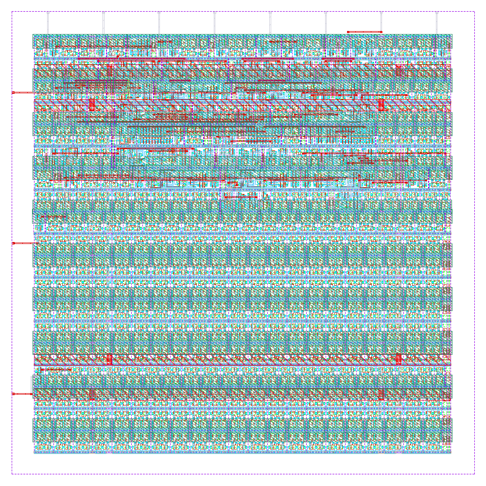

# ihp-sg13cmos5l Counter

<p align="center">
  <a href="final/render/counter.png">
    
  </a>
  <br>
  <em>Render of the ihp-sg13cmos5l counter layout.</em>
</p>


## Directory Structure

<details>
<summary>Show Directory Structure</summary>

```text
📁 counter/
├─ 📁 final/
│  ├─ 📁 gds/
│  │  └─ counter.gds
│  ├─ 📁 lef/
│  │  └─ counter.lef
│  ├─ 📁 lib/
│  │  ├─ 📁 nom_fast_1p32V_m40C/
│  │  ├─ 📁 nom_slow_1p08V_125C/
│  │  └─ 📁 nom_typ_1p20V_25C/
│  ├─ 📁 nl/
│  │  └─ counter.nl.v
│  ├─ 📁 pnl/
│  │  └─ counter.pnl.v
│  ├─ 📁 render/
│  │  └─ counter.png
│  ├─ 📁 spef/
│  │  └─ 📁 nom/
│  └─ 📁 vh/
│     └─ counter.vh
├─ 📁 flow/
│  ├─ 📁 final/               # .gitignore'd — important files are copied to counter/final/ (listed here to document LibreLane output folders)
│  │  ├─ 📁 def/              # Design Exchange Format — cell placement & routing (text-based)
│  │  ├─ 📁 gds/              # GDSII layout — final tape-out file
│  │  ├─ 📁 json_h/           # Yosys JSON headers — machine-readable netlist for internal scripts
│  │  ├─ 📁 klayout_gds/      # KLayout GDS — with extra visual-debug metadata
│  │  ├─ 📁 lef/              # Library Exchange Format — abstract pin & blockage view for P&R
│  │  ├─ 📁 lib/              # Liberty timing files — timing, power & area models
│  │  ├─ 📁 mag/              # Magic layout files — used for DRC & GDS generation
│  │  ├─ 📁 mag_gds/          # GDS generated/processed by Magic
│  │  ├─ 📁 nl/               # Netlist — gate-level Verilog after synthesis
│  │  ├─ 📁 odb/              # OpenDB — internal OpenROAD binary database (LEF+DEF combined)
│  │  ├─ 📁 pnl/              # Powered Netlist — gate-level Verilog with explicit power pins (for LVS)
│  │  ├─ 📁 render/           # Layout render images
│  │  ├─ 📁 sdc/              # Synopsys Design Constraints — clock periods & timing requirements
│  │  ├─ 📁 sdf/              # Standard Delay Format — timing delays for gate-level simulation
│  │  ├─ 📁 spef/             # Standard Parasitic Exchange Format — RC parasitics from layout
│  │  ├─ 📁 spice/            # SPICE netlist — for LVS & transistor-level simulation
│  │  ├─ 📁 vh/               # Verilog headers — for hierarchy management & simulation inclusion
│  │  ├─ metrics.csv          # Design metrics (area, power, timing slack, DRC/LVS) — spreadsheet
│  │  └─ metrics.json         # Design metrics (area, power, timing slack, DRC/LVS) — JSON summary
│  └─ 📁 librelane/
│     ├─ config.yaml
│     ├─ impl.sdc
│     ├─ pin_order.cfg
│     └─ signoff.sdc
├─ 📁 fpga/
│  ├─ 📁 basys3/
│  │  ├─ basys3.xdc
│  │  └─ Makefile
│  ├─ 📁 boolean/
│  │  ├─ boolean.xdc
│  │  └─ Makefile
│  ├─ 📁 icebreaker/
│  │  ├─ icebreaker.pcf
│  │  └─ Makefile
│  ├─ 📁 nano9k/
│  │  ├─ Makefile
│  │  └─ nano9k.cst
│  ├─ 📁 pico-ice/
│  │  └─ Makefile
│  ├─ 📁 ulx3s/
│  │  ├─ Makefile
│  │  └─ ulx3s.lpf
│  ├─ dut.mk
│  ├─ Makefile
│  └─ README.md
├─ 📁 netlist/
│  ├─ 📁 nl/
│  │  └─ counter.nl.v
│  ├─ 📁 pnl/
│  │  └─ counter.pnl.v
│  ├─ 📁 spice/
│  │  └─ counter.spice
│  └─ 📁 xspice/
│     └─ counter.xspice
├─ 📁 rtl/
│  └─ counter.sv
├─ 📁 schematic/
│  └─ 📁 xschem/
│     ├─ counter.sym
│     └─ xschemrc
├─ 📁 scripts/
│  ├─ sak-pin-reorder.py
│  ├─ spi2xspice.py
│  └─ .sak-scripts-version
├─ 📁 testbenches/
│  ├─ 📁 cocotb/
│  │  ├─ counter_tb.gtkw
│  │  └─ counter_tb.py
│  ├─ 📁 verilog/
│  │  ├─ counter_tb.gtkw
│  │  └─ counter_tb.sv
│  └─ 📁 xschem/
│     ├─ 📁 plot_simulations/
│     │  ├─ 📁 data/
│     │  ├─ 📁 figures/
│     │  ├─ ngspice2python.py
│     │  └─ plot_counter.py
│     ├─ counter_tb_tran.sch
│     └─ xschemrc
├─ 📁 verification/
│  ├─ antenna_summary.rpt
│  ├─ antenna_violations.rpt
│  ├─ stapostpnr_summary.rpt
│  ├─ stapostpnr_nom_fast_1p32V_m40C_power.rpt
│  ├─ stapostpnr_nom_slow_1p08V_125C_power.rpt
│  ├─ stapostpnr_nom_typ_1p20V_25C_power.rpt
│  ├─ irdrop.rpt
│  ├─ drc.magic.rpt
│  ├─ drc.klayout.json
│  ├─ lvs.netgen.rpt
│  ├─ manufacturability.rpt
│  ├─ stat.rpt
│  ├─ yosys_post_dff.rpt
│  ├─ yosys_pre_techmap.rpt
│  └─ yosys_synth_check.rpt
├─ Makefile
└─ README.md
```

</details>


## Makefile Targets

### Show Available Targets

The default Make target is `help`, so running `make` prints usage and all available targets with short descriptions.

```sh
make
make help
```


### Linting

To lint the Verilog/SystemVerilog source files with [Verilator](https://www.veripool.org/verilator/), run:

```sh
make lint-verilog                # lint the counter design
make lint-verilog CELL=counter   # equivalent: CELL defaults to counter
make lint-verilog-all            # lint all source files
```

When `CELL=counter` (the default), all synthesis sources are passed to Verilator.
For another cell, the RTL source is auto-selected as `rtl/<CELL>.sv` when present, otherwise `rtl/<CELL>.v`.

This is also the lint step used by `make all`.


### Verification and Simulation

We use [cocotb](https://www.cocotb.org/), a Python-based testbench environment, and [Icarus Verilog](https://github.com/steveicarus/iverilog) for the verification of the macro.

The simulation targets are unified and accept an optional `CELL` variable (default: `counter`).
The waveform viewer can be changed with `WAVEFORM_VIEWER=<gtkwave|surfer>` (default: `gtkwave`).

> [!NOTE]
> [Surfer](https://surfer-project.org/) is currently **not** available in the nix shell — use the default GTKWave there. Surfer is provided by the IIC-OSIC-TOOLS container.

> [!NOTE]
> In the current repository state, the provided Verilog, cocotb, and Xschem testbench/viewer files are for `counter`.
> Running simulation/view targets with another `CELL` requires corresponding testbench files (for example, `testbenches/verilog/<CELL>_tb.*`, `testbenches/cocotb/<CELL>_tb.py`, and `testbenches/xschem/<CELL>_tb_tran.sch`).

#### RTL Verilog Simulation

Compiles the RTL with Icarus Verilog and runs the simulation.
When `CELL=counter` (the default), the full `MODULES_SIM` source list and the `.sv` testbench are selected automatically.
For other cells, the RTL source is auto-selected as `rtl/<CELL>.sv` when present, otherwise `rtl/<CELL>.v`, and the testbench likewise as `testbenches/verilog/<CELL>_tb.sv` when present, otherwise `testbenches/verilog/<CELL>_tb.v`.
The waveform is written to `testbenches/verilog/` (e.g. `testbenches/verilog/counter_tb.fst`):

```sh
make sim-rtl-verilog              # run counter RTL simulation
```

To view the waveform afterwards:

```sh
make sim-view-verilog                                  # view counter waveform
make sim-view-verilog WAVEFORM_VIEWER=surfer           # use Surfer instead
```

The simulation folder contains a pre-configured waveform layout file (`counter_tb.gtkw` for GTKWave, `counter_tb.surf.ron` for Surfer).
The view target loads it automatically together with the current `.fst`, so signal formatting is preserved across runs.

#### RTL / GL cocotb Simulation

The cocotb testbench is located in `testbenches/cocotb/counter_tb.py` and exercises:

- reset clears the counter to 0
- the counter holds its value while `enable_i` is low
- the counter increments by 1 on every rising clock edge while `enable_i` is high
- the counter wraps from `CTR_MAX` back to 0

```sh
make sim-rtl-cocotb               # run counter RTL cocotb simulation
```

To run the gate-level (GL) cocotb simulation (sources the post-synthesis netlist from `final/nl/`):

```sh
make sim-gl-cocotb                # gate-level simulation of counter
```

> [!NOTE]
> Gate-level simulation requires the latest implementation in `flow/final/` (and a `final/nl/counter.nl.v` copy via `make copy-final`).

A waveform file is generated under `testbenches/cocotb/sim_build/counter.fst`.
To view it:

```sh
make sim-view-cocotb                                  # view counter waveform
make sim-view-cocotb WAVEFORM_VIEWER=surfer           # use Surfer instead
```

The cocotb folder contains a pre-configured waveform layout file (`counter_tb.gtkw` for GTKWave, `counter_tb.surf.ron` for Surfer).
The view target loads it automatically together with the current `.fst`, so signal formatting is preserved across runs.

#### Gate-Level Xschem Simulation

> [!TIP]
> This gate-level flow brings the hardened digital macro into Xschem as an XSPICE model, so it can be simulated together with analog circuitry in ngspice. This is what enables **analog mixed-signal designs** in Xschem. Instantiate the `counter` symbol next to your analog blocks in a testbench schematic and simulate the whole system in one run.

Runs the mixed-signal gate-level transient simulation testbench in `testbenches/xschem/<CELL>_tb_tran.sch`:

```sh
make sim-gl-xschem                # run counter gate-level Xschem simulation
make sim-gl-xschem CELL=<cell>    # run gate-level Xschem simulation for another cell
make sim-gl-xschem TB=<tb>        # run another testbench (default: <CELL>_tb_tran)
```

The testbench is selected with the `TB` variable, given without the `.sch` extension (default: `<CELL>_tb_tran`). All testbench schematics are located in `testbenches/xschem/`, and the generated netlists are written to `testbenches/xschem/simulations/`.

The simulation runs in **batch mode**: the target netlists the testbench with `xschem netlist` and then invokes `ngspice -b` directly instead of using `xschem simulate`. `xschem simulate` would spawn an interactive ngspice in a terminal detached from `make`: the target would return immediately, the result would never be checked, and the process would leak. Running the simulator directly makes `make` block until the run finishes and see its exit status.

Because the run is headless, the `plot` commands in a testbench's `.control` block are a no-op and no plot windows appear. Every testbench instead exports its results with `wrdata` to `testbenches/xschem/plot_simulations/data/`, from where they are plotted with `sim-view-xschem`.

> [!NOTE]
> This flow expects the generated XSPICE model in `netlist/xspice/`. It is generated automatically by `make build-top` (right after `copy-netlist`), so it always matches the current LibreLane run. To regenerate it manually, run:
>
> ```sh
> make generate-xspice
> ```

> [!NOTE]
> Besides this XSPICE-based gate-level flow, Xschem also supports true RTL mixed-signal co-simulation with ngspice and Verilog (see [Ngspice + Verilog Co-Simulation in Xschem](https://www.youtube.com/watch?v=PPd7jkcHOgA)).

#### View Xschem Simulation Results

After the gate-level Xschem simulation has completed, plot the results with:

```sh
make sim-view-xschem              # plot counter simulation results (default: plot_counter)
make sim-view-xschem SCRIPT=<scriptname>  # run another plotting script
```

The target runs `python3 testbenches/xschem/plot_simulations/<SCRIPT>.py` (default: `plot_<CELL>`) and exports the figures and a CSV to `testbenches/xschem/plot_simulations/figures/`. The `SCRIPT` variable is given without the `.py` extension.

> [!NOTE]
> `sim-view-xschem` is intentionally **not** called by `sim-all`. It opens an interactive plot window and must be called manually after the simulation has completed.

#### Run All Simulations

To run all simulation targets in sequence:

```sh
make sim-all
```

This executes the following targets in order:

1. `sim-rtl-verilog` (default: `counter`)
2. `sim-rtl-cocotb` (default: `counter`)
3. `sim-gl-cocotb` (default: `counter`)
4. `sim-gl-xschem` (default: `counter`)

> [!NOTE]
> The `sim-view-verilog` and `sim-view-cocotb` targets are intentionally **not** called by `sim-all`.
> Both open a waveform viewer GUI (GTKWave or Surfer), which blocks the shell until the window is closed.
> They are designed for interactive use and must be called manually after the simulation has completed.


### LibreLane Flow

Run the LibreLane flow with:

```sh
make librelane
```

Additional targets are available for different DRC configurations:

- `make librelane-nodrc` – run LibreLane without DRC checks
- `make librelane-magicdrc` – run LibreLane with only Magic DRC checks
- `make librelane-klayoutdrc` – run LibreLane with only KLayout DRC checks

After the LibreLane flow completes successfully, the generated views are saved under `flow/final/`. `flow/final/` is included in `.gitignore`.


### View the Design

After completion, you can view the design using the OpenROAD GUI:

```sh
make librelane-openroad
```

Or using KLayout:

```sh
make librelane-klayout
```


### Copy Important Reports

To copy the yosys synthesis checks, antenna reports, post-PnR timing summary, per-corner power reports, IR-drop report, Magic/KLayout DRC results, LVS report, and manufacturability report from the latest run into `verification/`, run:

```sh
make copy-reports
```

This only works if at least one LibreLane run exists in `flow/librelane/runs/` and the latest run completed without errors.


### Copy the Final Folders

To copy the latest GDS, LEF, LIB, NL, PNL, SPEF, VH, and render from `flow/final/` into `final/`, run:

```sh
make copy-final
```

This assumes the final folders exist under `flow/final/` after a successful LibreLane run.

The layout render in `final/render/` is produced by LibreLane itself and is simply copied along with the other views, so there is no separate render target.


### Copy the Final Netlist

To copy the latest SPICE, PnL, and Netlist files from `flow/final/` into `netlist/`, run:

```sh
make copy-netlist
```

This only works if the required final views exist in `flow/final/spice/`, `flow/final/pnl/`, and `flow/final/nl/`.


### Build FPGA

The FPGA flow emulates `counter` standalone (native `clk_i`/`rst_ni`/`enable_i`/`count_o` ports, no chip-level wrapper) and targets a [ULX3S](https://radiona.org/ulx3s/) board by default (ECP5, Yosys → nextpnr-ecp5 → ecppack), flashed with `openFPGALoader`.
It shares its recipe logic (`fpga.mk`) with the top-level chip flow in `../../fpga/`.
`fpga/` is a thin dispatcher — it forwards every target to `<board>/Makefile`, defaulting to `BOARD := ulx3s`.
Other supported boards are iCEBreaker, Tang Nano 9K, pico-ice, and, via the separate `nix-openxc7` Xilinx toolchain vendored at the repo root, Basys 3/Boolean — see `fpga/README.md` for the full board matrix.

To run the full flow (synthesis → place-and-route → bitstream), run:

```sh
make build-fpga
```

This invokes `make -C fpga all`. Individual steps can also be run from `fpga/` (or e.g. `fpga/icebreaker/` for another board):

```sh
make -C fpga synthesis
make -C fpga pr              # nextpnr place-and-route
make -C fpga gen_bitstream   # ecppack → .bit
make -C fpga load_bitstream  # load into SRAM via openFPGALoader
make -C fpga flash_bitstream # optional: write to flash instead, to survive a power cycle
```

> [!NOTE]
> Loading and flashing differ per board/toolchain — each Makefile sets `LOAD_CMD`/`FLASH_CMD` accordingly.
> The default ULX3S flow and most other boards use `openFPGALoader`; pico-ice uses `dfu-util` instead, since its RP2040 co-processor acts as a USB DFU bootloader that `openFPGALoader`/`iceprog` don't speak to directly.

See `../../fpga/README.md` for the full shared-flow reference (variables, targets, adding a new board).


### Build Top

To build the macro with LibreLane, copy its reports, copy final folders, copy netlists, and generate the XSPICE model, run:

```sh
make build-top
```


### Design Rule Check (DRC) & Layout Versus Schematic (LVS)

The LibreLane flow already includes DRC and LVS checks with Magic and KLayout, and they are saved in the `verification/` folder.


### Lint, Build, Verify and Simulate All

Lints, builds, verifies and simulates the whole macro:

- `lint-verilog-all`
- `build-fpga`
- `build-top`
- `sim-all`

Linting runs first to fail fast on structural RTL issues. The simulations run **after** the build, so the gate-level simulations (`sim-gl-cocotb`, `sim-gl-xschem`) run on the netlists and the XSPICE model produced by this build, not on those of a previous one. The DRC and LVS verification is done within the LibreLane flow.

```sh
make all
```


### Generate XSPICE File

To generate an XSPICE file of the macro for mixed-signal simulation in Xschem, run:

```sh
make generate-xspice
```

This builds the XSPICE model **directly from the LibreLane-extracted SPICE netlist** in `netlist/spice/<TOP>.spice` (copied from the last run by `make copy-netlist`). Two scripts do the work:

1. `scripts/spi2xspice.py` replaces every standard cell with an XSPICE primitive (`d_lut`, `d_dff`, …), taking the pin order from the inline black-box `.subckt` stubs in the extracted netlist and the logic functions from the liberty file.
2. `scripts/sak-pin-reorder.py` (vendored from [IIC-OSIC-TOOLS](https://github.com/iic-jku/IIC-OSIC-TOOLS), see `scripts/.sak-scripts-version`) reorders the resulting `.subckt` ports to match the Xschem symbol in `schematic/xschem/<TOP>.sym` (`--format xspice`).

> [!NOTE]
> This target runs automatically as part of `make build-top` (right after `copy-netlist`), so the XSPICE model always matches the netlists of the current LibreLane run. The simulation timing parameters (`-io_time`, `-time`, `-idelay`, `-odelay`, `-cload`) are pinned in the Makefile, so regeneration is deterministic.
> Conversion pipeline: extracted SPICE (`.spice`) → XSPICE (`.xspice`) → reorder pins according to the Xschem symbol.

#### What You Must Consider

To get a working gate-level Xschem simulation from a LibreLane-generated netlist, two things must line up:

**1. Power nets must not collide with the testbench `.GLOBAL` nets.**
The extracted netlist names its supplies `VPWR`/`VGND` (the heichips26 template uses the PDK default power pins). If the digital block exposed a node that merges with an analog global supply net of the surrounding testbench, ngspice would abort with `singular matrix: check node ...`. `spi2xspice.py` avoids this by bridging every power (and otherwise unused) boundary net to a private `dig_<net>` node. Nothing is required from you here, but keep it in mind if you adapt the script or rename supplies.

**2. Symbol pins must declare their netlist name via `sim_pinname`.**
Magic sorts the top-level ports alphabetically, so their order in the extracted netlist does **not** match the symbol. `scripts/sak-pin-reorder.py` therefore maps pins **by name**: every pin in `schematic/xschem/<TOP>.sym` must carry a `sim_pinname=<netlist_name>` property, where the name is the RTL/netlist signal name, e.g.

```
B 5 ... {name=clk_i          dir=in    sim_pinname=clk_i}
B 5 ... {name=count_o[0..7]  dir=out   sim_pinname=count_o}
B 5 ... {name=VPWR           dir=inout sim_pinname=VPWR}
```

The script derives the XSPICE pin from that name (`clk_i` → `a_clk_i`, `count_o[0]` → `a_count_o_0_`) and matches by it, independent of port order. A bus `sim_pinname` is given as a bare base (`count_o`). The symbol bus indices are applied to it.

> [!NOTE]
> When you add a port to the design, add the matching pin to the symbol **and** give it a `sim_pinname` equal to the netlist signal name. A mismatch is caught: the script aborts with a clear `expects XSPICE pin ... which is not in the .subckt` error instead of silently mis-wiring.
> If any pin lacks `sim_pinname`, the script falls back to positional matching (power by a fixed name-map, signals by position), which is only correct when the netlist keeps the symbol's port order (e.g. a yosys `.nl.v` netlist).

Then run the gate-level simulation as usual (see [Gate-Level Xschem Simulation](#gate-level-xschem-simulation)):

```sh
make sim-gl-xschem
```


### Clean

`make clean` deletes all generated files and folders. The sources (RTL, testbenches, symbols, scripts, and the LibreLane configuration) stay untouched. Deleted are:

- `flow/librelane/runs/` and `flow/final/` (LibreLane runs and output views)
- `final/` (GDS, LEF, LIB, netlist, SPEF, Verilog header, and render deliverables)
- `netlist/` (extracted netlists and the XSPICE model)
- `verification/` (the copied LibreLane reports)
- `testbenches/cocotb/sim_build/` and the Verilog testbench waveforms (`*.fst`)
- `testbenches/xschem/simulations/` and the `plot_simulations/` outputs (`data/`, `figures/`, `__pycache__/`)
- the FPGA build outputs (via `make -C fpga clean`)

Every Makefile target recreates its output folders, so a clean rebuild is simply:

```sh
make clean
make all
```

> [!NOTE]
> The Xschem testbench `.include`s the XSPICE model `netlist/xspice/counter.xspice`. Directly after `make clean`, run `make build-top` (or the full `make all`) once before `make sim-gl-xschem`, otherwise the include fails.
