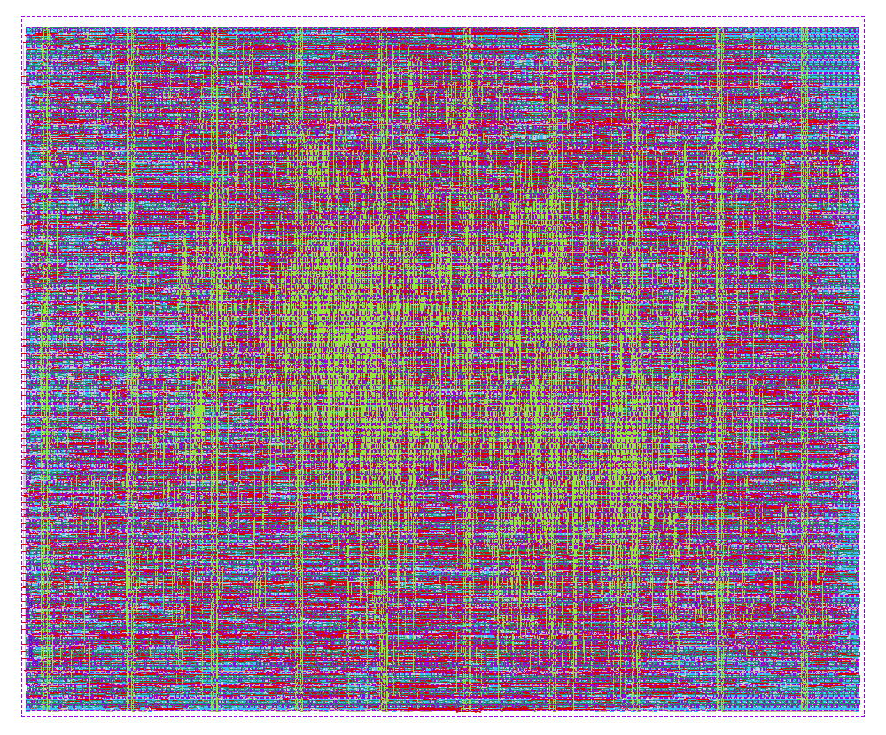

# heichips26_e2spike (ihp-sg13cmos5l)

<p align="center">
  <a href="final/render/heichips26_e2spike.png">
    
  </a>
  <br>
  <em>Layout of heichips26_e2spike, 500 µm × 415 µm, large HeiChips slot.</em>
</p>

This macro is the E2Spike accelerator for the HeiChips 2026 chip. It holds the layer
controller, the processing elements and the SDSP learning rule. It has no memory of
its own: the input sample, the weights, the layer configuration and the membrane
potentials all live in the 1024 × 32 SRAM that the HeiChips eFPGA offers to its
bitstream, and the macro reaches that SRAM through its pins.

The layer sequence is fixed in the RTL: three depthwise separable blocks (ds1 to
ds3, each a depthwise convolution, a pointwise convolution and pooling) followed by
two fully connected layers (fc1, fc2), with multi-level LIF spikes over four time
steps. Where each layer finds its parameters and how many channels and positions it
has comes from a table in the SRAM image. With learning enabled, the SDSP rule
updates the fc2 weights in the SRAM.

The views in `final/` are what `submission.yaml` points at. Their signoff is in
[`verification/`](verification/README.md).


## Pins

| Pin | Dir | Function |
|---|---|---|
| `clk` | in | clock |
| `rst_n` | in | reset, active low, asynchronous |
| `ui_in[15:0]` | in | SRAM read data, one 16-bit beat per cycle |
| `uo_out[15:0]` | out | SRAM write data, one 16-bit beat per cycle |
| `uio_out[9:0]` | out | SRAM logical address; bit 9 is always 0 |
| `uio_out[10]` | out | read request (REN), one-cycle pulse |
| `uio_out[11]` | out | write request (WEN), one-cycle pulse |
| `uio_out[12]` | out | `gbl_finish`, one-cycle pulse at the end of an inference |
| `uio_out[13]` | out | `class_label`, valid in the `gbl_finish` cycle |
| `uio_out[15:14]` | out | 0 |
| `uio_in[0]` | in | `gbl_start`, a one-cycle pulse starts an inference |
| `uio_in[1]` | in | `online_training_disable`: 1 inference only, 0 SDSP learning on |
| `uio_in[15:2]`, `ena` | in | unused |
| `uio_oe[15:0]` | out | tied to 0 |

`uio_oe` is 0 on every bit even though `uio_out[13:0]` carries signals. The eFPGA
gets `uio_out` and `uio_oe` as separate signals, so the bitstream has to use
`uio_out` without gating it by `uio_oe`.


## SRAM interface

The macro addresses a logical memory of 512 words of 64 bits. The memory controller
between macro and SRAM maps logical word `a` onto two physical words,
`{phys[a + 512], phys[a]}`, and the image in `interface/` is laid out for that
mapping.

An access is a one-cycle REN or WEN pulse with the address on `uio_out[8:0]`,
followed by the 64-bit word as four 16-bit beats in the order `phys[a][15:0]`,
`phys[a][31:16]`, `phys[a+512][15:0]`, `phys[a+512][31:16]`.

* Read: the controller puts the four beats on `ui_in` in the four cycles after the
  REN cycle.
* Write: the macro drives the four beats on `uo_out` in the WEN cycle and the three
  cycles after it.
* Two accesses start at least five cycles apart.

The macro cannot run without this controller. [`testbenches/verilog/efpga_mem_ctrl.v`](testbenches/verilog/efpga_mem_ctrl.v)
implements it for the pins of the IHP SRAM, [`rtl/fpga_emu/mem_ctrl.v`](rtl/fpga_emu/mem_ctrl.v)
is the same logic for the FPGA board. On the chip it has to be part of the eFPGA
bitstream (Yosys `synth -lut 4` estimate: 76 LUT4 and 16 flip-flops), together with
a way to write the image into the SRAM.


## Memory image

[`interface/bank_cfg.pat`](interface/bank_cfg.pat) is the SRAM content for sample 0
of the chb01 EEG set: 1024 lines, one 32-bit hex word per physical address, readable
with `$readmemh`. [`rtl/fpga_emu/bank_cfg.coe`](rtl/fpga_emu/bank_cfg.coe) holds the
same words for the Vivado block RAM.

Fixed regions, in logical addresses:

| Logical words | Content |
|---|---|
| 0 to 159 | feature map, 4 time steps × 40 words; every layer writes its output back here |
| 278 to 287, high half | layer table, two words per layer (physical 790 to 799) |
| 490 to 493 | spike scratch per time step |
| 496 to 503 | depthwise membrane potentials |
| 504 to 511 | pointwise membrane potentials |

A spike is a 2-bit code for the amplitudes 0, 1, 2 and 4. Bit 0 of every channel's
code sits in the low half of a feature map word, bit 1 in the high half. The input
layer packs two positions of 16 channels into one word, all later layers one
position of up to 32 channels.

The layer table as it is in the image, logical addresses:

| L | Layer | `weight` | `pw_scale` | `scale` | `pw_weight` | `length` | `in_ch` | `out_ch` |
|---|---|---|---|---|---|---|---|---|
| 0 | ds1 | 160 | 168 | 234 | 234 | 80 | 16 | 32 |
| 1 | ds2 | 180 | 196 | 238 | 298 | 40 | 32 | 32 |
| 2 | ds3 | 208 | 224 | 246 | 426 | 20 | 32 | 16 |
| 3 | fc1 | 180 | 230 | 236 | 254 | 40 | 16 | 8 |
| 4 | fc2 | 180 | 494 | 236 | 270 | 40 | 8 | 8 |

Layer L's 64-bit entry has its low 32 bits in the high half of logical word
`278 + 2L` and its high 32 bits in the high half of `279 + 2L`:

| Bits | Field | Meaning |
|---|---|---|
| [8:0] | `weight` | depthwise weights and biases, alternating per group of 4 channels: weights of channels 0 to 3, their biases, weights of 4 to 7, ... |
| [17:9] | `pw_scale` | three words per group of 8 output channels: scales, biases of outputs 0 to 3, biases of outputs 4 to 7 |
| [26:18] | `scale` | depthwise scales, high half, 4 channels per word |
| [35:27] | `pw_weight` | pointwise weights, low half, one word per group of 8 outputs and input channel; for fc1 and fc2 one word per input channel in the high half |
| [43:36] | `length` | input length per time step (`max_lenth` in the RTL) |
| [49:44] | `in_ch` | input channels |
| [55:50] | `out_ch` | output channels |

Weights are signed 4-bit, biases signed 16-bit. A scale byte shifts right when bit 7
is 1 and left when it is 0, by the amount in bits 2:0 (`0x83` is a right shift by 3).


## Running an inference

1. Write the image into the SRAM.
2. Pulse `rst_n` low.
3. Set `uio_in[1]`: 1 for inference only, 0 to let SDSP learning update the fc2 weights.
4. Pulse `uio_in[0]` high for one cycle.
5. Wait for the `gbl_finish` pulse on `uio_out[12]` and latch `uio_out[13]` in that
   cycle. An inference takes 651,328 cycles after the start pulse with learning off
   and 651,552 with learning on, whatever the data.
6. For the next sample write the next image and go back to step 2. The only weights
   learning changes are physical words 782 to 789 (fc2, high half of logical 270 to
   277); keep them to carry the learned weights over.

Step 2 is needed before every inference, see known issue 1.


## Known issues

1. **`rst_n` has to be pulsed before every `gbl_start`.** After an inference,
   `SPARSE_CORE.read_en_seq` still holds fc2's last write-back bits. At the next
   `gbl_start` the layer table read turns them into a spurious `wb_mp_finish`, the
   inference ends 142 cycles early, and a few spikes come out wrong in every layer.
   With sample 100 of chb01 run after sample 0, 11 of 5120 spikes differ from the
   golden model in ds1, 8 of 2560 in ds2, 1 of 640 in ds3 and 1 of 32 in fc1; the
   class was still right. With a reset in between, both inferences match the model.
   Running the same image twice does not show the problem. Forcing only
   `read_en_seq` to 0 before the second inference makes its SRAM access trace
   identical to a fresh run, so clearing that register at the start of an inference
   should fix it in the RTL.
2. **The SDSP rule treats the signed 4-bit weights as unsigned.** It saturates at 15
   and 0 instead of +7 and -8, and it compares the membrane potential without sign.
   A weight at +7 that is potentiated wraps to -8. In a sweep of 80 input
   combinations through the learning rule, 20 differ from signed saturating
   arithmetic. Running sample 0 three times with learning on gives 24 weight steps,
   5 of them from +7 to -8, and the third run classifies sample 0 as class 1. The
   gate-level netlist makes the same SRAM accesses, wraps included, in the first two
   runs. Inference with `uio_in[1] = 1` is not affected.
3. **Slow corner timing.** Setup closes at the 10 ns constraint in the typical and
   fast corners. In the slow corner (1.08 V, 125 °C) it needs 12.21 ns, 82 MHz.
   The HeiChips chip top is constrained to 15 ns.
4. **Word 232, fixed in the image.** fc1's scale and bias block (230 to 232) and
   fc2's (232 to 234) both used logical word 232, so fc1's output channel 4 got a bias
   of -31869 and never fired. fc2's block now sits at 494, a change of three physical
   words (232, 494, and the layer table word 798) with no RTL change. Over the 200
   chb01 samples in the bit-accurate model this raises the accuracy from 89.0 % to
   91.0 %; the floating-point model reaches 92.5 %.


## Simulation

The testbench in [`testbenches/verilog/`](testbenches/verilog/) drives the macro
at its pins through `efpga_mem_ctrl.v` and the IHP SRAM model from the PDK. It loads
the image, runs one inference and checks the SRAM after every layer word for word
against `expected/`, the class, the cycle count, the SRAM protocol, and X on the
request pins, the address and the write data. The reference snapshots come from an
RTL run whose every layer matched the bit-accurate golden model.

Run it inside the repository's Nix shell, with the PDK cloned by `make clone-pdk` in
the repository root (or `PDK_ROOT` set):

```sh
make sim-rtl-verilog                          # RTL, about 1 min
make sim-gl-verilog                           # final/nl, flip-flops starting at 0 and at 1, about 9 min
make sim-all                                  # both
make sim-rtl-verilog TB_ARGS=+WAVES           # also dump a waveform
make sim-view-verilog                         # open it
make sim-rtl-verilog TB_ARGS="+NINFER=2 +RESET_BETWEEN"
```

The plusargs are listed at the top of `heichips26_e2spike_tb.v`. `TB_CHECKS` holds the
comparison against `expected/`; set `TB_CHECKS=` when simulating another image with
`+MEMFILE=`.

650 of the netlist's 753 flip-flops have their reset input tied inactive, and the IHP
cell models start them as X. `gl_udp_init.py` writes a copy of the cell primitives
with a defined start value, and `sim-gl-verilog` runs the netlist once from all 0 and
once from all 1.

`rtl/tb/` holds the team's module-level testbenches from development.


## Directory structure

| Path | Content |
|---|---|
| `final/` | committed views: gds, lef, lib, nl, pnl, spef, vh, render |
| `flow/librelane/` | LibreLane configuration, SDC files, HeiChips DEF templates |
| `interface/` | `bank_cfg.pat`, the SRAM image |
| `rtl/` | accelerator RTL; `rtl/*.v` is what LibreLane synthesizes |
| `rtl/fpga_emu/` | Basys 3 top, memory controller for a block RAM, `bank_cfg.coe` |
| `rtl/tb/` | module-level testbenches |
| `testbenches/verilog/` | pin-level testbench, eFPGA memory controller, reference snapshots |
| `verification/` | signoff reports of the committed views |
| `fpga/` | from the HeiChips template, still builds the template design |
| `macros/counter/` | from the HeiChips template, not used by E2Spike |


## FPGA emulation

`rtl/fpga_emu/basys3_top.sv` runs the macro RTL on a Basys 3 with `mem_ctrl.v` in
front of a block RAM (the Vivado project is not in the repository). SW0 is reset
(0 holds the design in reset), a rising edge on SW1 starts an inference, SW2 = 1
disables learning. LED0 shows `gbl_finish`, LED1 `class_label`.

The `fpga/` flow and `macros/counter/` come from the HeiChips template: `fpga/dut.mk`
still lists `heichips26_digital_project.sv` and the counter, so `make build-fpga`
and `make all` do not build E2Spike.


## Rebuilding the layout

```sh
make librelane     # LibreLane with Magic and KLayout DRC
make copy-final    # flow/final -> final/
```

A new layout needs the precheck (`make precheck` in the repository root),
`make sim-gl-verilog` and new reports in `verification/`. `make copy-reports`
replaces `verification/` with the reports of the last LibreLane run. `make clean`
deletes `final/`, `netlist/` and `verification/` as well as the run directories.
